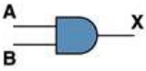
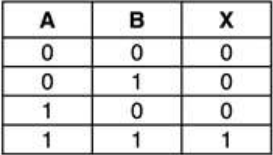
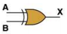
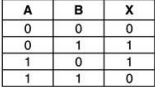
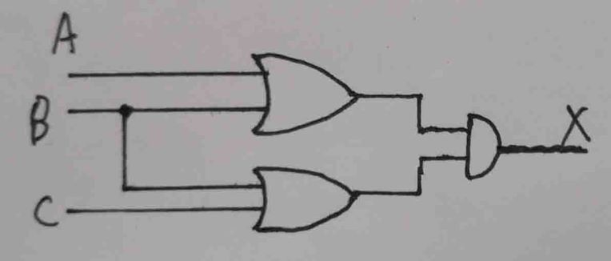
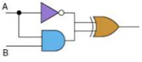
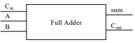
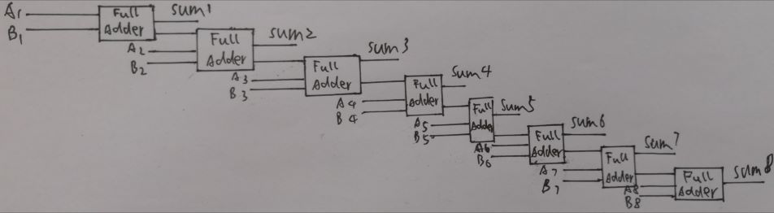

# homework05

## Part 1

1) Give the three representations of an AND gate and say in your
words what AND means.

AND gate

|Boolean Expression（布尔表达式）|Logic diagram（逻辑图）|Truth table（真值表）|
|:----------:|:-----------------:|:---------------------:|
|$$X = A • B$$||

AND:与门相当于串联，“与”是同时的意思，即A和B两个条件同时满足（即都为1）时，才为正确（即输出1），否则为错误（即输出0）。与门是用于实现“乘”运算的电路。

2) Give the three representations of an XOR gate and say in your
words what XOR means.

 XOR gate

|Boolean Expression（布尔表达式）|Logic diagram（逻辑图）|Truth table（真值表）|
|:-----------------:|:--------------------:|:-----------------------:|
|$$X = A ⊕ B$$||

XOR:异或相当于不进位的二进制加法，又叫半加运算。当A和B相同时（即都为0或都为1）输出 0，当A和B不同时（即为0和1）输出1。

3) Draw a circuit diagram corresponding to the following Boolean expression: (A + B)(B + C) 

4) Show the behavior of the following circuit with a truth table: 

|A|B|X|
|:-----:|:-----:|:-----:|
|0|0|1
|0|1|1
|1|0|0
|1|1|1

5) What is circuit equivalence? Use truth table to prove the
following formula. 
(AB)' = A'+ B' 
circuit equivalence（电路等价）意思是两个电路的效果相同，即两个电路输入相同时输出也相同。

Left:

|A|B|X|
|:-----:|:-----:|:-----:|
|0|0|1
|0|1|1
|1|0|1
|1|1|0

Right:

|A|B|X|
|:-----:|:-----:|:-----:|
|0|0|1
|0|1|1
|1|0|1
|1|1|0

由于等式左右电路的真值表相同，故两个电路等价，等式成立。

## Part 2

6) There are eight 1bit full adder integrated circuits. Combine them to 8bit adder
circuit using the following box diagram. 
 

7) Logical binary operations can be used to modify bit pattern. Such as
(X8X7X6X5X4X3X2X1
)2 and (00001111)2= (0000X4X3X2X1
)2
We called that (00001111)2
is a mask which only makes low 4 bits to work. 
Fill the follow expression

(1)  (X8X7X6X5X4X3X2X1
)2 or (00001111)2 = (X8X7X6X51111)2

(2)  (X8X7X6X5X4X3X2X1
)2
xor (00001111)2 = (X8X7X6X5X'4X'3X'2X'1)2

(3) 
 ((X8X7X6X5X4X3X2X1
)2 and (11110000)2 )
or (not X8X7X6X5X4X3X2X1
)2
and (00001111)2
) = (X8X7X6X5X'4X'3X'2X'1)2

## Part 3

### 1)Logic gate

In electronics, a logic gate is an idealized or physical device implementing a Boolean function; that is, it performs a logical operation on one or more binary inputs and produces a single binary output. Depending on the context, the term may refer to an ideal logic gate, one that has for instance zero rise time and unlimited fan-out, or it may refer to a non-ideal physical device (see Ideal and real op-amps for comparison).

### 2)Boolean algebra

In mathematics and mathematical logic, Boolean algebra is the branch of algebra in which the values of the variables are the truth values true and false, usually denoted 1 and 0 respectively. Instead of elementary algebra where the values of the variables are numbers, and the prime operations are addition and multiplication, the main operations of Boolean algebra are the conjunction and denoted as ∧, the disjunction or denoted as ∨, and the negation not denoted as ¬. It is thus a formalism for describing logical relations in the same way that elementary algebra describes numeric relations.

自学存储电路。维基百科：“Flip-flop”，选择中文： 
1)Flip-flop 中文翻译是？  
触发器

2)How many bits information does a SR latch store? 
1位