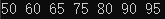

# homework10

### 1. Bubble Sort the list: 33, 56, 17, 8, 95, 22。Make sure the final result is from small to large.

Write out the list after the 2nd pass. (10 points) 
33 17 8 56 95 22 

### 2. Give a sorted array as list={60,65,75,80,90,95}. Design an algorithm to insert the value of x into the sorted array. Then test the algorithm with value 50,67,99.

    #include<stdio.h>

    int main()
    {
	    int arr[7]={60,65,75,80,90,95};
	    int num,flag=6;
	
	    scanf("%d",&num);               //输入要插入的数
	
	    for(int i=0;i<6;i++)
	    {
		    if(num<arr[i])
		    {
			    flag=i;         //标记插入数在数组中的位置
			    break;
		    }
	    }
	    for(int i=5;i>=flag;i--)        //将该位置之后的数字全部向后移一位
		    arr[i+1]=arr[i];
	
	    arr[flag]=num;                  //将插入数放入该位置
	
	    for(int i=0;i<6;i++)            
	    {
		    printf("%d ",arr[i]);   //打印数组
	    }
	    printf("%d\n",arr[6]);
	
	    return 0;
    }

输入50： 
输入67： 
输入99： 

思考：为什么选择插入点在list头上、中间、尾巴上的三个数作为算法测试的数据，你能解释吗？ 

因为这三个数对应了将数字插入list前、list中、list后三种情况。 

### 3. What is the state of the stack after the following sequence of Push and Pop operations?

Push “anne”; Push “get”; Push “your” ; Pop; Push “my”; Push “gun”;  

(1)Push “anne”; 
anne 
(2)Push “get”; 
get 
anne 
(3)Push “your”; 
your 
get 
anne 
(4)Pop; 
get 
anne 
(5)Push “my”; 
my 
get 
anne 
(6)Push “gun”; 
gun 
my 
get 
anne 