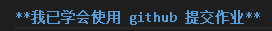
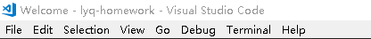
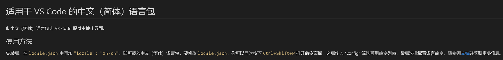
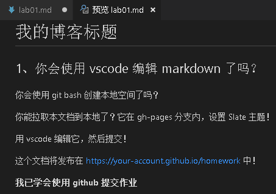
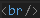
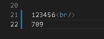
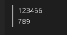

# 关于VScode和markdow的几个问题

Hello,world! 
第一篇博客就写写研tong究ku了几晚VS code和markdown遇到的困难吧。

 
真的学会了吗T_T

## 1.VS code换字体
兴高采烈的下好VS code却发现长得和指南里不一样？ 
 
（英语渣瑟瑟发抖）

其实在左边最后的扩展里搜索language找到简体中文，下载后按照流程做即可。
 

## 2.Markdown预览网页
做了修改又嫌麻烦不想再提交推送在网页上查看效果？ 
其实通过快捷键就可以预览： 
 
可以按下Ctrl+Shift+V;也可以先按Ctrl + K，然后放掉，紧接着再按 V，都能调出实时预览框。（要在英文输入状态下）

## 3.文本换行
终于做完第一次作业，打开一看却发现字都挤在一起? 
当然你可以像模板中那样在编辑时多空出一行，但如果想让文章更紧凑，只需在需要换行处加上就可以实现换行。 
如图 
 
效果图 

那么第一篇博shui客wen就到这里