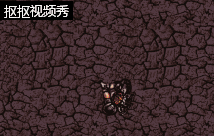

# 让你的'Ghost Shooter'游戏更精彩！

通过[Construct 2的教程](https://www.scirra.com/tutorials/37/beginners-guide-to-construct-2){:target="_blank"}，我们能很快做出自己的第一个游戏'Ghost Shooter' 
 
看起来很棒吧！但借助Construct 2的强大功能，我们可以让这个游戏更加精彩！

## 1、添加墙壁

地图太空了没意思？我们可以通过添加一些墙壁来作为障碍或掩体。 
首先，我们需要在网上寻找一个可以作为墙壁的素材。 
 
然后，创造一个精灵命名为“Wall”，加入我们找到的素材，然后通过ctrl键制造它的复制。 
接着，为我们的精灵加入“solid”行为，即固体，使我们的“Wall”变成真正的墙壁。 
 
不要忘了把“子弹”精灵和“怪物”精灵的"Bounce off solid"属性调为"Yes" 
 
这样他们才不会穿过墙壁 
最后不要忘了运行游戏来查看效果 
 
这样就大功告成了！通过你自己的创造，你可以为这个游戏加入更多元素，甚至在其中加入一个迷宫。

## 2、添加音乐

游戏没有bgm就没有激情？我们可以自己添加音乐到游戏中。
首先，同样要找好需要的音频。 
然后，在右上角的“Projects”栏中找到“Music”文件夹（“Sounds”文件夹也可），右键单击它以导入音频。 
 
由于不同的浏览器支持的音频格式不同，所以音频文件格式需要为.m4a或.ogg。但事实上我们并不需要自己动手，Construct 2会自动帮我们转换音频格式。 
 
接着新建一个“Audio”项目，在事件表中添加如下事件： 
 
（你可以通过编辑“volume”来调节音量） 
最后，进入游戏感受音乐的魅力吧！

## 3、添加按钮

为了方便玩家，我们可以在游戏中加入一些按钮。
首先，我们在空白处单击右键创建新项目以添加按钮。 
 
同时为按钮命名以便区分。 
 
接着，我们对按钮进行设置。 
对于音乐的播放和暂停，我们加入以下事件和动作： 
 
对于游戏的暂停和继续，我们加入以下事件和动作： 
 
当然我们也可以通过设置键盘按键来进行以上操作，例如暂停游戏： 
 
完成后，进入游戏查看效果。

Construct 2的功能强大，只要发挥你的想象力，不断探索，就能让你的游戏更加精彩。
## 玩得开心！