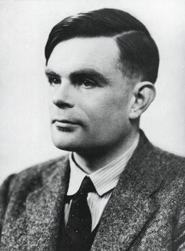

# 我喜欢的IT电影———模仿游戏

要当一名程序员，怎能不了解理论计算机科学和人工智能之父Alan Turing。下面我就推荐一部介绍图灵生平的电影———[模仿游戏](http://list.youku.com/show/id_z6618f85c420f11e3a705.html?tpa=dW5pb25faWQ9MTAzNzUzXzEwMDAwMV8wMV8wMQ&refer=baiduald1705){:target="_blank"}。这部电影十分精妙地介绍了图灵的生平，主要聚焦了图灵破译德军密码系统“英格玛”的过程，而影片中图灵与审讯他的警官Nock即场示范“模仿游戏”即“图灵测试”的桥段更是引人深思。

## 关于电影

故事分为三条线进行，第一条线是图灵在上中学时的经历。图灵虽天赋异禀，但因性格问题被同学欺负，只有Christopher与他交好，Christopher引导图灵接触密码学，图灵也逐渐对他产生了感情，然而Christopher不幸因结核病去世，图灵选择隐瞒自己的感情。 
 
Christopher和图灵

第二条线是图灵和一群顶尖人才破译纳粹德军的密码系统“英格玛”的过程，这也是本片的重头戏。起初，图灵的自负心理使他不能很好地融入小组中，而当琼加入后，她开导图灵让他敞开心扉，一组人逐渐团结起来。但当图灵研发的密码破译机器“Christopher”（现实中叫Bombe）遇到瓶颈，迟迟不能在限定时间内完成破译工作时，又遭到指挥官Denniston的不满和催促。 
 
图灵和他的密码破译机

面对困难，图灵从琼的朋友的话中得到启发：每份电报中都有一些重复部分，可以从中推出部分密码的对应关系，使得Christopher不必计算全部1590万万亿种可能。图灵和他的同伴通过这个思路终于用“Christopher”成功打败了“Enigma”。 
 
一句话点出了破译的关键，一句重复的“希特勒万岁”打败了纳粹。

第三条线是1951年，两名警察Nock和Staehl在家中被明显闯入后对图灵进行了调查，却发现了图灵同性恋的秘密。当Nock审问图灵时，图灵与警官进行了一场“模仿游戏”，也就是著名的“图灵测试”，警官Nock惊讶之余却不能做出判断。后来，为不进监狱而影响工作，图灵最后选择接受化学阉割,他也因此身心恶化。影片最后以图灵关闭“Christopher”作为结尾，而据官方记载，图灵食用含氰化物的苹果自杀。
 
图灵的结局是悲剧的

值得一提的是，电影中审问图灵的警官Nock，并不是真实存在的人物。他象征那个时代被制度化的恐同心理，以表现逮捕与迫害图灵的人不是残忍的疯子而是最普通的人。

## 关于图灵

 
图灵在数理逻辑方面提出了“可计算性理论”，在计算机领域对人工智能深入思考，提出了著名的“图灵测试”：远处的人类测试者在一段规定的时间内，根据两个实体对他提出的各种问题的反应来判断是人类还是电脑。通过一系列这样的测试，从电脑被误判断为人的几率就可以测出电脑智能的成功程度。他的理论对人工智能发展的贡献一直延续至今。 
他破译的“英格玛”密码系统，据历史学家估计，此举使二战至少提早两年结束，拯救了1400万生命。而他提出的“图灵机”，经过无数科学家的努力，成为了如今的“计算机”。 
为纪念图灵，美国计算机协会设立“图灵奖”，被喻为“计算机界的诺贝尔奖”。而在2013年，伊丽莎白女王宣布图灵获得“皇家赦免”。

影片中图灵说的一句话值得我们铭记：
## Sometimes it’s the very people who no one imagines anything of who do the things no one can imagine.有时候正是那些人们认为的无用之人成就了无人所成之事。