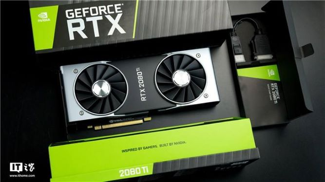
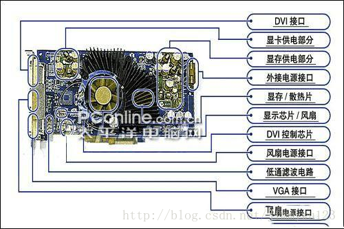

# 我的科普博客————关于显卡

提到显卡，我们第一时间想到的就是与打游戏、看电影有关，但显卡究竟是如何将电脑中储存的0和1转化为游戏和电影中令人惊叹的图像的呢？通过查阅资料，我将简单介绍一下显卡。

## 基本情况

显卡（Video card）是个人计算机最基本组成部分之一，用途是将计算机系统所需要的显示信息进行转换驱动显示器，并向显示器提供逐行或隔行扫描信号，控制显示器的正确显示，是连接显示器和个人计算机主板的重要组件，是“人机对话”的重要设备之一。（摘自维基百科）它常与GPU混淆，但其实GPU（Graphics Processing Unit图形处理器）是显卡芯片，我们常说的GTX、RTX其实是GPU，但被用来代指显卡。

显卡芯片 

目前主要的显卡芯片制造商有AMD和NVIDIA，而后者最新推出的RTX2080Ti也成了热门话题。 
 
~~谁给我买这个煤气灶我们就是一辈子的朋友（破音~~

## 分类

显卡主要包括核芯显卡、集成显卡以及独立显卡。 

核芯显卡是Intel产品新一代图形处理核心，和以往的显卡设计不同，Intel凭借其在处理器制程上的先进工艺以及新的架构设计，将图形核心与处理核心整合在同一块基板上，构成一颗完整的处理器。智能处理器架构这种设计上的整合大大缩减了处理核心、图形核心、内存及内存控制器间的数据周转时间，有效提升处理效能并大幅降低芯片组整体功耗，有助于缩小了核心组件的尺寸，为笔记本、一体机等产品的设计提供了更大选择空间。

核显优点是价格便宜，缺点是难以胜任大型游戏。

集成显卡是将显示芯片、显存及其相关电路都集成在主板上，与其融为一体的元件；集成显卡的显示芯片有单独的，但大部分都集成在主板的北桥芯片中；一些主板集成的显卡也在主板上单独安装了显存，但其容量较小，集成显卡的显示效果与处理性能相对较弱，不能对显卡进行硬件升级，但可以通过CMOS调节频率或刷入新BIOS文件实现软件升级来挖掘显示芯片的潜能。

集显优点是功耗低，发热量小，缺点是其性能略低，且由于其固化在CPU上，故难以更换。

独立显卡是指将显示芯片、显存及其相关电路单独做在一块电路板上，自成一体而作为一块独立的板卡存在，它需占用主板的扩展插槽（ISA、PCI、AGP或PCI-E)。

独显优点是性能高，易于升级更换，缺点是价格相对较高，发热量大，占用更多空间（特别对于笔记本电脑）~~性能高就完事了~~

## 组成与工作原理

显卡的主要组成部分为显示接口、显卡芯片（GPU）、显示内存、RAMDAC（数模转换器）。 
 

数据（也就是计算机储存的0和1）共需要四个步骤转换为图像到达显示屏。

#### （1）数据通过显卡接口①由CPU进入显卡芯片组，由GPU对这些数据进行处理
#### （2）GPU处理完的数据再从显卡芯片进入显卡内存暂时储存
#### （3）从显存读取出数据进入RAMDAC进行数据转换（数字信号转模拟信号）
#### （4）RAMDAC②将转换后的模拟信号送到显示屏

其中最重要的是（2）（3）步骤，这两个步骤决定了显卡的性能。 
可以看出，GPU与显存的关系就如同CPU与内存的关系，我们可以认为显卡就是一台专门用于处理色彩编码的微型计算机。

注： 
①显卡是插在主板上的扩展槽（也就是显卡接口）里的（现在一般是PCI-E插槽，此前还有AGP、PCI、ISA等插槽）。随着技术发展，处理图像是需要传输的数据越来越多，所以显卡接口也在不断升级。

②实际上，显示屏上输出的数据是一张一张的，只是速度高过你肉眼的反应速度，所以看不到它在闪烁。为了完成这一步，就需要RAMDAC极高的传输速率（RAMDAC的传输速率用MHz表示），而它也决定了显卡所支持的最高分辨率。