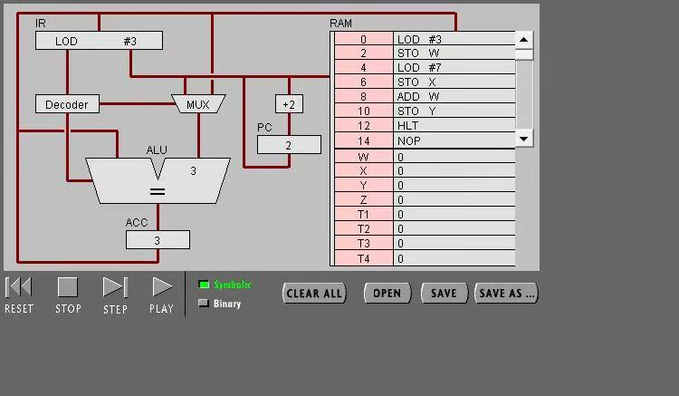
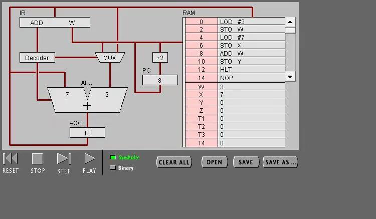
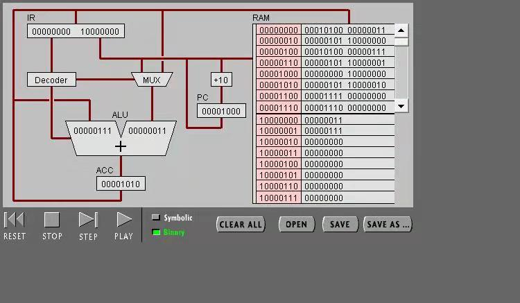
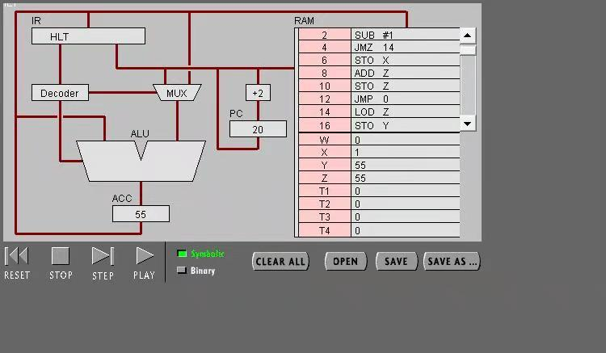

# 机器语言实验报告

## 目录

- [实验目标](#实验目标) 
- [实验步骤与结果](#实验步骤与结果) 
- [实验小结](#实验小结) 

## 实验目标

· 理解冯·诺伊曼计算机的结构 
· 理解机器指令的构成 
· 理解机器指令执行周期 
· 用汇编编写简单程序 

## 实验步骤与结果

任务 1：简单程序

（1）打开网页 The PIPPIN User’s Guide ，然后输入 Program 1：Add 2 number 
（2）点step after step。观察并回答下面问题： 

1.PC，IR 寄存器的作用。 
PC:程序计数器, 用于指示计算机在其程序序列中的位置 
IR:指令寄存器, 用来储存执行中指令的暂存器 

2.ACC 寄存器的全称与作用。 
ACC全称Accumulator，累加寄存器, 专门存放算术或逻辑运算的一个操作数和运算结果 

3.用“LOD #3”指令的执行过程，解释Fetch-Execute周期。 

1)根据地址获取下一条指令LOD 3，储存到IR（指令寄存器）中。 
2)将指令传到decoder。 
3)不需要获得数据。 
4)将3传入ALU（加法器）中再传入ACC（累加器）。 
 

4.用“ADD W” 指令的执行过程，解释Fetch-Execute周期。 

1)根据地址获取下一条指令ADD W，储存到IR中。 
2)指令传入decoder。 
3)ALU从ACC中取出暂存的X，IR根据地址访问RAM，取出W的值，将W的值放入加法器中。 
4)执行指令，ALU执行加法后将结果放入ACC。 
 

5.“LOD #3” 与 “ADD W” 指令的执行在Fetch-Execute周期级别，有什么不同。 
LOD #3不需要读取数据ADD W需要进入内存读取W的值。 

（3）点击“Binary”,观察回答下面问题 

 

1.写出指令 “LOD #7” 的二进制形式，按指令结构，解释每部分的含义。 

LOD #7：00010100 00000111 
前八位为指令，其中第四位为寻址模式，1代表数值，0代表地址，此处为1表示数值；后四位为操作码，此处为LOD。 
后八位为操作数，表示数值或地址，此处为数值7。 

2.解释 RAM 的地址。 
RAM的地址表示指令或变量储存的位置，需要时通过读取地址便可以获取指令或变量的值 

3.该机器CPU是几位的？（按累加器的位数） 
8位。 

4.写出该程序对应的 C语言表达。 

    int w=3;
    int x=7;
    int y;
    y=x+w;

任务 2：简单循环 

（1） 输入程序Program 2，运行并回答问题： 

 

1.用一句话总结程序的功能 
初始化X为3，使X不断减1直到X=0结束 

2.写出对应的 c 语言程序 

    int x=3;
    while(x>0)
    {
        x--;
    }

（2） 修改该程序，用机器语言实现 10+9+8+..1 ，输出结果存放于内存 Y 

 

1.写出 c 语言的计算过程 

    int x=11;
    int y;
    int z=0;
    while(x>0)
    {
        x--;z=z+x;
    }
    y=z;

2.写出机器语言的计算过程 

00000000 00000100 10000001 
00000010 00010001 00000001 
00000100 00001101 00001110 
00000110 00000101 10000001 
00001000 00000000 10000011 
00001010 00000101 10000011 
00001100 00001100 00000000 
00001110 00000100 10000011 
00010000 00000101 10000010 
00010010 00001111 00000000 

10000001 00001011 
10000010 00000000 
10000011 00000000 

 

3.用自己的语言，简单总结高级语言与机器语言的区别与联系。 

区别：高级语言更接近于人类的语言，用于方便人类使用；机器语言是由0和1组成，用于给机器读取。 
联系：高级语言是由机器语言汇编而成的，在实际运行时高级语言会经编译转为机器语言，最终实现的效果是相同的。 

## 实验小结

通过对cpu运行过程的实验和研究，加深理解了冯·诺伊曼计算机的结构； 
在实验中通过编写机器语言并观察机器指令在cpu中的运行，逐渐了解机器指令的构成以及机器指令执行周期； 
通过交替编写c语言和机器语言，逐渐能够通过机器语言实现简单功能，用汇编编写简单程序。 
