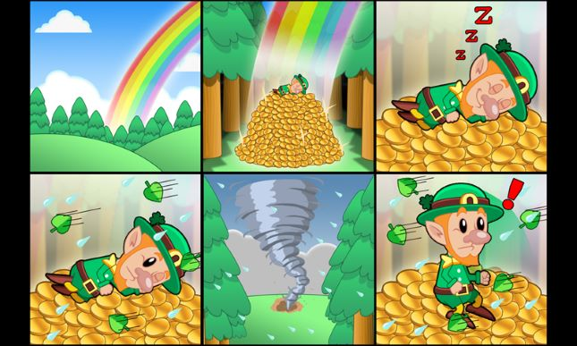
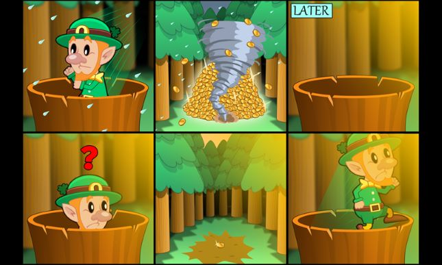
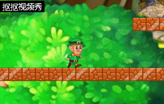
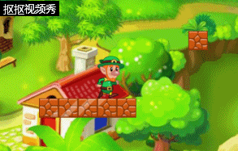
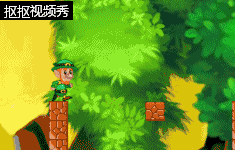

# HTML5游戏设计与制作

## 游戏策划

1.故事背景 
一天，伐木工小林结束了一天的工作，决定在森林里休息。当他醒来，他惊讶地发现发现自己躺在一堆金币上。但这时，一阵狂风吹过，小林急忙躲到一旁的树丛中。当狂风过去，他发现金币堆已经被吹跑了，地上只剩一枚金币，于是，他决定深入森林去寻找金币...... 
 
 

2.玩法 
通过键盘上的方向键控制小林，找到金币堆即为游戏结束，若不慎掉落则会重新开始游戏。 

3.人设和物品 
伐木工小林：对重复的工作感到厌烦，总希望能够一夜暴富。 
金币堆：小林一直追求的财富，具有极高的价值，只是，它是真的吗...... 

## 游戏设计

Object Name:Player 
Attributes: 
 
(480,1538) 
Collaborator:Gold 
Events & Actions:左右移动，向上跳跃 

Object Name:Gold 
Attributes: 
 
(3827, 1217) 
Collaborator:Player 
Events & Actions:触发游戏结束 

Object Name:Stone 
Attributes: 
 
Collaborator:None 
Events & Actions:固定不动 

Object Name:Stone2 
Attributes: 
 
Collaborator:None 
Events & Actions:固定不动 

Object Name:Stone3 
Attributes: 
 
Collaborator:Player 
Events & Actions:固定不动, Player向下时可穿过 

## 游戏实际效果

 

 

 