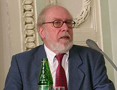

# 洗衣机算法设计———“自顶向下，逐步求精”的编程方法

## “自顶向下，逐步求精”——Top-down design

“自顶而下，逐步求精”的设计思想，其出发点是从问题的总体目标开始，抽象低层的细节，先专心构造高层的结构，然后再一层一层地分解和细化。这使设计者能把握主题，高屋建瓴，避免一开始就陷入复杂的细节中，使复杂的设计过程变得简单明了，过程的结果也容易做到正确可靠。 

在编程中，自上而下是一种编程风格，是传统程序语言的主流，其中设计从指定复杂的部分开始，然后将它们分成连续的小部分。使用自上而下方法编写程序的技术是编写一个主程序，命名它将需要的所有主要功能。 

#### 历史

1968年，结构化程序设计方法的研究。Dijkstra提出了“GOTO是有害的”，希望通过程序的静态结构的良好性保证程序的动态运行的正确性。 
1969年，Wirth提出采用“自顶向下逐步求精、分而治之”的原则进行大型程序的设计。其基本思想是：从欲求解的原问题出发，运用科学抽象的方法，把它分解成若干相对独立的小问题，依次细化，直至各个小问题获得解决为止。 

 
尼克劳斯·埃米尔·维尔特（德语：Niklaus Emil Wirth，1934年2月15日－） 

 
Wirth发表在ACM上的[论文](https://dl.acm.org/citation.cfm?id=362575.362577&coll=ACM&dl=ACM){:target="_blank"}

#### 设计方法

自顶向下 
程序设计时，应先考虑总体，后考虑细节；先考虑全局目标，后考虑局部目标。不要一开始就过多追求众多的细节，先从最上层总目标开始设计，逐步使问题具体化。 

逐步细化 
对复杂问题，应设计一些子目标作为过渡，逐步细化。 

模块化 
一个复杂问题，肯定是由若干稍简单的问题构成。模块化是把程序要解决的总目标分解为子目标，再进一步分解为具体的小目标，把每一个小目标称为一个模块。 

结构化编码 
所谓编码就是把已经设计好的算法用计算机语言表示，即根据已经细化的算法正确写出计算机程序。结构化的语言（如 Pascal，C，QBASIC等）都有与三种基本机构对应的语句。 

## 洗衣机算法设计

### 大步骤

1.打开电源。 
2.选择洗衣模式，水量。 
3.注水 
4.浸泡 
5.洗衣 
6.排水 
7.脱水 
8.结束。 

### 每个步骤的伪代码

	power_switch(on)					//打开电源

		GET pattern1,pattern2,time,heightIn,heightOut		
		SET h,t,n1,n2 to 0				//选择洗衣模式，水量
		
		water_in_switch(open)				//注水
			get_water_volume(h)
		IF h==heightIn
			water_in_switch(close)
		ENDIF
		
		time_counter(t)					//浸泡
		IF t==time
			continue
		ELSE 
			halt(failure)
		ENDIF

		WHILE n1<pattern1				//洗衣
			motor_run(left)
			motor_run(right)
			n1 add 1
		ENDWHILE

		water_out_switch(open)				//排水
			get_water_volume(h)
		IF h==heightOut
			water_out_switch(close)
		ENDIF

		WHILE n2<pattern2				//脱水
			motor_run(left)
			motor_run(right)
			n2 add 1
		ENDWHILE

		halt(success)					//结束

	power_switch(close)

通过编写洗衣机控制程序的伪代码，我们可以了解到“自顶向下，逐步求精”的编程方法的基本流程和优点。 
通过将复杂的程序分解为多个简单的子程序，可以大大降低编程的难度，同时便于对代码进行修改和调试，提高程序可读性。 
