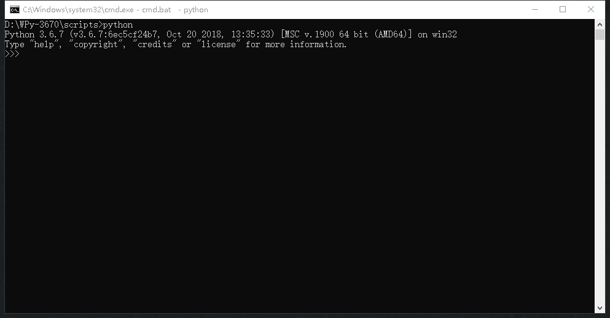
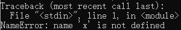
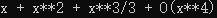
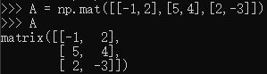
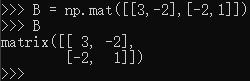
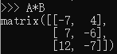
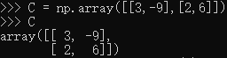
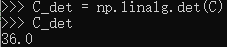
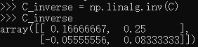

# python 编程实验报告

 

## 目录

- [实验目标](#实验目标) 
- [实验步骤与结果](#实验步骤与结果) 
    - [（1）用python做高等数学题](#（1）用python做高等数学题) 
    - [（2）用python做线性代数题](#（2）用python做线性代数题) 
- [实验小结](#实验小结) 

## 实验目标

1.了解一种“解释型”语言 python 
2.使用 python 做一些简单的科学计算 

## 实验步骤与结果

### （1）用python做高等数学题

使用 SymPy 的符号库 
通过$$>>>from sympy import *$$导入库中所有函数和常量、变量

1.泰勒分解 

求以下函数在x=0点的局部泰勒公式至所指定的阶数： 
exsin x   (x4)

首先定义一个x。 
~~否则就会这样~~ 
 

然后使用SymPy库中的函数series()来计算，输入如下： 
 
需要注意的是： 
1）exp（x）是一个math库中的函数，代表ex，使用前需先通过    $$>>> import math$$ 导入。 
2）series前的括号中为要求的函数，其后的括号中x为变量，0表示在x=0点，4表示分解至4阶，即x4。 

然后得到结果： 
 
其中 x**2 代表x2。 

2.计算不定积分 

\int 1/(1+x^4), dx

使用integrate()函数求不定积分 
输入如下： 
 

结果如下： 
 
（sqrt代表开根号；log代表ln） 

### （2）用python做线性代数题

使用Numpy库 
通过$$>>> import numpy as np$$（采用np代替numpy）导入numpy库 

1.矩阵乘法 

求矩阵A和B的乘积 

A= 
$$
  \left[
  \begin{matrix}
   -1 & 2 \\
   5 & 4 \\
   2 & -3
  \end{matrix}
  \right]
$$

B= 
$$
  \left[
  \begin{matrix}
   3 & -2 \\
   -2 & 1
  \end{matrix}
  \right]
$$

首先创建矩阵A和B: 
 
 

A, B都是matrix类型，可以直接使用乘号 
 
得到结果。 

2.矩阵的逆 

求矩阵C的逆 

C= 
$$
  \left[
  \begin{matrix}
   3 & -9 \\
   2 & 6
  \end{matrix}
  \right]
$$

创建矩阵C： 
 

求C的行列式，判断其是否可逆： 
 
detC不为0，故可逆。 

求逆矩阵： 
 
得到结果。 

## 实验小结

通过使用python，简单了解了python语言；并且能够使用python做一些高数、线代题；体会到python语言简单朴实的魅力。
