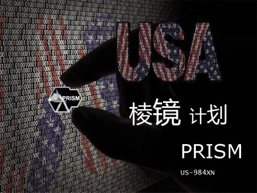
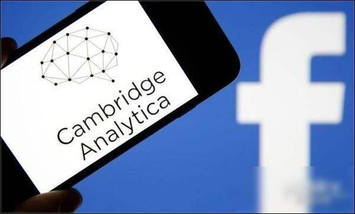

# IT伦理与道德研究

## 互联网时代还有没有隐私？

如今IT行业飞速发展，世界已经进入了互联网时代。但人们在享受互联网便利的同时，却也承担着个人信息泄漏的风险。事实上，随着近些年来个人信息泄漏事件不断被曝光，人们有了共同的疑问：互联网时代还有没有隐私？ 

### 我国保护公民个人隐私的法律

2009年《刑法》修正案： 
第285条 
违反国家规定，侵入前款规定以外的计算机信息系统或者采用其他技术手段，获取该计算机信息系统中存储、处理或者传输的数据，或者对该计算机信息系统实施非法控制，情节严重的，处三年以下有期徒刑或者拘役，并处或者单处罚金；情节特别严重的，处三年以上七年以下有期徒刑，并处罚金。 
提供专门用于侵入、非法控制计算机信息系统的程序、工具，或者明知他人实施侵入、非法控制计算机信息系统的违法犯罪行为而为其提供程序、工具，情节严重的，依照前款的规定处罚。 
第286条 
违反国家规定，对计算机信息系统功能进行删除、修改、增加、干扰，造成计算机信息系统不能正常运行，后果严重的，处五年以下有期徒刑或者拘役；后果特别严重的，处五年以上有期徒刑。 
违反国家规定，对计算机信息系统中存储、处理或者传输的数据和应用程序进行删除、修改、增加的操作，后果严重的，依照前款的规定处罚。 
故意制作、传播计算机病毒等破坏性程序，影响计算机系统正常运行，后果严重的，依照第一款的规定处罚。 
第253条 
国家机关或者金融、电信、交通、教育、医疗等单位的工作人员，违反国家规定，将本单位在履行职责或者提供服务过程中获得的公民个人信息，出售或者非法提供给他人，情节严重的，处三年以下有期徒刑或者拘役，并处或者单处罚金。 
窃取或者以其他方法非法获取上述信息，情节严重的，依照前款的规定处罚。 
单位犯前两款罪的，对单位判处罚金，并对其直接负责的主管人员和其他直接责任人员，依照各该款的规定处罚。 

除此之外，还有许多法律条例提到公民个人隐私问题，然而，个人隐私被泄漏的事件仍然层出不穷，多数人的信息仍然在“裸奔”。

### 有关隐私泄漏的事件及言论

#### 棱镜门

 
棱镜计划（英语：PRISM）是一项由美国国家安全局自2007年开始实施的绝密级网络监控计划。该计划的正式名称为“US-984XN”。 
根据报导，泄露的文件中描述PRISM计划能够对即时通信和既存资料进行深度的监听。许可的监听对象包括任何在美国以外地区使用参与计划公司服务的客户，或是任何与国外人士通信的美国公民。国家安全局在PRISM计划中可以获得数据电子邮件、视讯和语音交谈、影片、照片、VoIP交谈内容、档案传输、登入通知，以及社交网络细节。综合情报文件《总统每日简报》中在2012年内在1,477个计划使用了来自棱镜计划的资料。 
关于PRISM的报道，是在美国政府持续秘密要求威讯向国家安全局提供所有客户每日电话记录的消息曝光后不久出现的。泄露这些绝密文件的是国家安全局合约外包商员工爱德华·斯诺登，于2013年6月6日在英国《卫报》和美国《华盛顿邮报》公开。 
（摘自维基百科）

#### Facebook与Cambridge Analytica数据丑闻

 
2018年3月17日，美国的《纽约时报》，以及英国的《卫报》、《观察家报》一齐爆出消息：效力于特朗普2016总统竞选的数据分析公司Cambridge Analytica和与之关联的企业战略通信实验室公司（Strategic Communications Laboratories；简称SCL）剽窃并秘密保存了5000万Facebook用户的数据。这意味着Facebook竟让数千万的用户的数据落入这些人手中，并被不当使用，而且是用于影响大选。在隐私保护方面，这家社交媒体巨头本来就已经声名狼藉、四面楚歌，这消息一经曝出，更是一石激起千层浪。 
之后五天时间， Facebook首席执行官马克·扎克伯格（Mark Zuckerberg）保持着一些人所说的“极其惹眼的沉默”。五天过去了，他终于在Facebook个人主页上发表长文，回应此事。之后，他接受了包括《连线》在内的少数几家媒体的采访，表示歉意、承认错误，甚至出人意料地表示，（对Facebook实施）监管也是可以的。 
（摘自https://www.zaojiu.com/talks/1892）

#### 李彦宏：中国用户很多时候愿意用隐私来换便捷服务

 
2018年3月26日，百度公司董事长兼CEO李彦宏出席中国高层发展论坛“创新引领未来”专场论坛。在回答如何使用数据这一问题时，李彦宏表示， “当你把不同数据汇聚在一起，力量就会更强大。我们也非常了解隐私问题或者说如何保护隐私。我认为在过去的几年里，中国已经越来越意识到这个问题的重要性，而且执法力度也加强了许多。同时我也认为，中国人对隐私问题的态度更加开放，也相对来说没那么敏感。如果他们可以用隐私换取便利、安全或者效率。在很多情况下，他们就愿意这么做。当然我们也要遵循一些原则，如果这个数据能让用户受益，他们又愿意给我们用，我们就会去使用它的。我想这就是我们能做什么和不能做什么的基本标准。” 
（摘自新京报网）

从美国国家安全局到社交平台巨头Facebook，可以看到即使是国家机构、行业巨头，仍然有泄漏个人信息的风险，更不要说那些不知名的网站或软件了。而百度CEO李彦宏的言论更是让人悚然：有多少人是“被自愿”地泄漏自己的信息？为了便捷，人们是否会将自己的信息“公之于众”？

IT行业中的个人隐私问题，不仅是法律上的问题，更是伦理与道德的问题。维护个人隐私，需要用户提高防护意识，需要政府施行相关法律，更需要企业规范自身，自觉保护用户个人信息。