# 贪吃蛇实验报告

## 目录
- [实验目的](#实验目的)
- [实验步骤与结果](#实验步骤与结果)
    - [任务1：会动的蛇](#任务1会动的蛇)
    - [任务2：会吃的蛇](#任务2会吃的蛇)
- [实验小结](#实验小结)

## 实验目的

1.了解字符游戏的表示 
2.体验自顶向下的设计方法实现问题求解 
3.使用伪代码表示算法 
4.使用函数抽象过程 

## 实验步骤与结果

### 任务1：会动的蛇

首先设计程序的头部： 
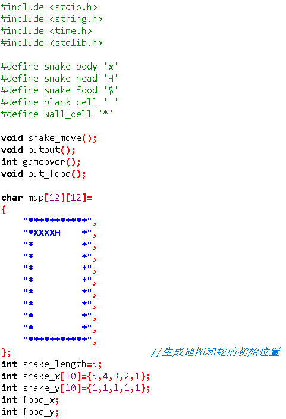 

然后完成主函数main 
伪代码： 

	WHILE not 游戏结束 DO
        输出字符矩阵
	    action＝等待输入
        snakeMove；
	    CASE action DO
		‘A’:snakeHeadMove左前进一步，break 
		‘D’:snakeHeadMove右前进一步，break    
		‘W’:snakeHeadMove上前进一步，break    
		‘S’:snakeHeadMove下前进一步，break    
		END CASE
	END WHILE
	输出 Game Over!

实现： 
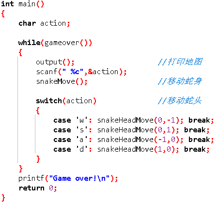 

接着完成子函数 

函数output 
实现： 
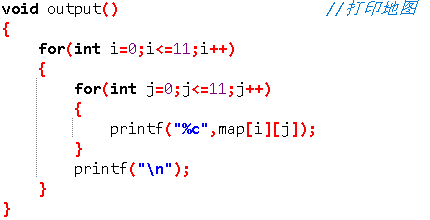 

函数snakeMove 
伪代码： 

    map[蛇尾]=blank_cell;
    SET i=snake_length;
    WHILE i>0
        snake[i]=snake[i-1];
        map[snake[i]]=snake_body;
        i--;
    ENDWHILE

实现： 
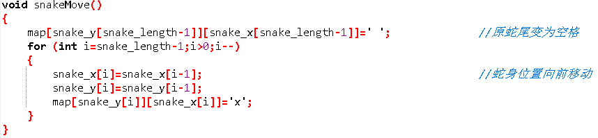 

函数snakeHeadMove 
伪代码： 

    GET m,n;
        snake_x[0]+=m;
        snake_y[0]+=n;
        map[snake[0]]=snake_head;

实现： 
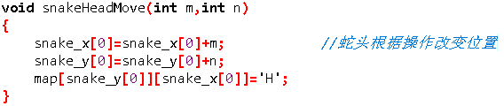 

函数gameover 
伪代码： 

    IF snake[0]==wall_cell
        return 0;
    ELSEIF snake[0]==snake_body
        return 0;
    ELSE
        return 1;
    ENDIF

实现： 
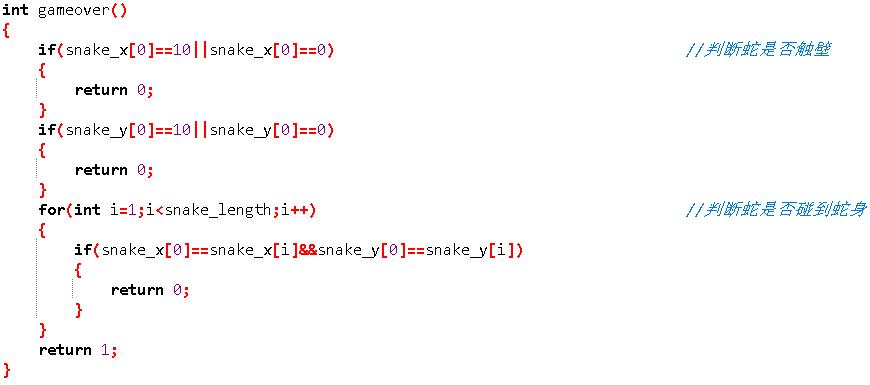 

最后组合完成移动的蛇。 
效果： 
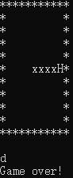 

### 任务2：会吃的蛇

完成蛇的“吃”动作只需在“动”的基础上加入生成食物函数以及加入蛇“吃到食物”时的判断即可。 

在主函数中加入蛇“吃到食物”时的判断 
伪代码： 

    IF snake[0]==snake_food
        snake_length++;
        map[蛇尾]==snake_body;

实现： 
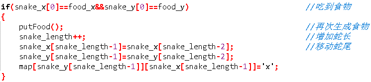 

函数putFood 

实现： 
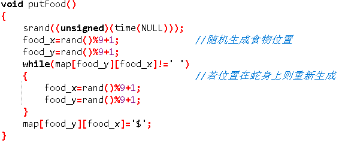 

结合后效果： 
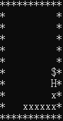
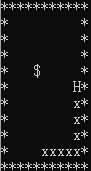 

## 实验小结

了解了字符游戏，初步了解自顶向下的设计方法实现问题求解，学会使用伪代码和编写函数。 

贪吃蛇完整代码： 

    #include <stdio.h>
    #include <string.h>
    #include <time.h>
    #include <stdlib.h>

    #define snake_body 'x'
    #define snake_head 'H'
    #define snake_food '$'
    #define blank_cell ' '
    #define wall_cell '*'

    void snakeMove();
    void output();
    int gameover();
    void putFood();
    void snakeHeadMove(int ,int ); 

    char map[12][12]=
    {
        "***********",
        "*xxxxH    *",
        "*         *",
        "*         *",
        "*         *",
        "*         *",
        "*         *",
        "*         *",
        "*         *",
        "*         *",
        "***********",
    };							        //生成地图和蛇的初始位置 
    int snake_length=5;
    int snake_x[10]={5,4,3,2,1};
    int snake_y[10]={1,1,1,1,1};
    int food_x;
    int food_y;

    int main()
    {
	    char action;
        putFood();						        //生成食物 
        while(gameover())
	    {
		    output();					        //打印地图 
            scanf(" %c",&action);
            snakeMove();				                //移动蛇身 
        
            switch(action)				                //移动蛇头 
            {
                case 'w': snakeHeadMove(0,-1); break;
                case 's': snakeHeadMove(0,1); break;
                case 'a': snakeHeadMove(-1,0); break;
                case 'd': snakeHeadMove(1,0); break;
            }

            if(snake_x[0]==food_x&&snake_y[0]==food_y)		//吃到食物 
            {
                putFood();						//再次生成食物 
                snake_length++;					//增加蛇长 
                snake_x[snake_length-1]=snake_x[snake_length-2];	//移动蛇尾 
                snake_y[snake_length-1]=snake_y[snake_length-2];
                map[snake_y[snake_length-1]][snake_x[snake_length-1]]='x';
            }
        }
        printf("Game over!\n");
        return 0;
    }

    void output()						        //打印地图 
    {
        for(int i=0;i<=11;i++)
	    {
            for(int j=0;j<=11;j++)
		    {
                printf("%c",map[i][j]);
            }
            printf("\n");
        }
    }

    void snakeMove()
    {
        map[snake_y[snake_length-1]][snake_x[snake_length-1]]=' ';	//原蛇尾变为空格 
        for (int i=snake_length-1;i>0;i--)
	    {
            snake_x[i]=snake_x[i-1];			        //蛇身位置向前移动 
            snake_y[i]=snake_y[i-1];
            map[snake_y[i]][snake_x[i]]='x';
        }
    }

    void snakeHeadMove(int m,int n)
    {
	    snake_x[0]=snake_x[0]+m; 			                //蛇头根据操作改变位置
        snake_y[0]=snake_y[0]+n;
        map[snake_y[0]][snake_x[0]]='H';
    }

    int gameover()																
    {
        if(snake_x[0]==10||snake_x[0]==0)                           //判断蛇是否触壁 
	    {
            return 0;
        }
        if(snake_y[0]==10||snake_y[0]==0)
	    {
            return 0;
        }
        for(int i=1;i<snake_length;i++)				//判断蛇是否碰到蛇身 
	    {
            if(snake_x[0]==snake_x[i]&&snake_y[0]==snake_y[i])
		    {
                return 0;
            }
        }
        return 1;
    }

    void putFood()
    {
        srand((unsigned)(time(NULL)));
        food_x=rand()%9+1;				                //随机生成食物位置 
        food_y=rand()%9+1;
        while(map[food_y][food_x]!=' ')
	    {								//若位置在蛇身上则重新生成 
            food_x=rand()%9+1;
            food_y=rand()%9+1;
        }
        map[food_y][food_x]='$';
    }
