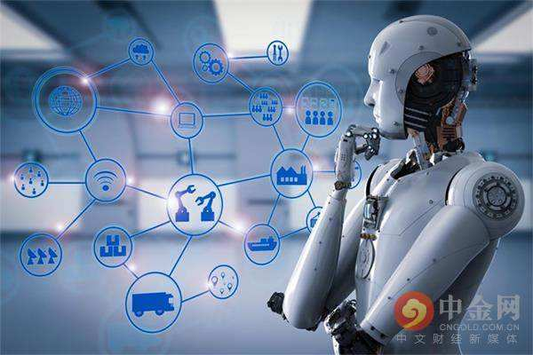

# IT风投之我见

## 关于风险投资

### 简介

风险投资（英语：Venture Capital，缩写为VC）简称风投，又译称为创业投资，是一种私募股权，一种融资形式，由公司或基金提供给被认为具有高增长潜力或已经表现出高增长的小型早期新兴公司（员工数量，年收入或两者兼而有之）。

### 特点

风险投资之所以被称为风险投资，是因为在风险投资中有很多的不确定性，给投资及其回报带来很大的风险。一般来说，风险投资都是投资于拥有高新技术的初创企业，这些企业的创始人都具有很出色的技术专长，但是在公司管理上缺乏经验。另外一点就是一种新技术能否在短期内转化为实际产品并为市场所接受，这也是不确定的。还有其他的一些不确定因素导致人们普遍认为这种投资具有高风险性，但是不容否认的是风险投资的高回报率。

也许最被人们熟悉但却也最不被人理解的一种投资风险是市场风险。在一个高度流通的市场，比如说在世界各地的股票交易市场，股票的价格取决于供求关系。假设对于一个特定的股票或者债券，如果它的需求上升，价格会随之上调，因为每个购买者都愿意为股票付出更多。

风险投资家既是投资者又是经营者。风险投资家一般都有很强的技术背景，同时他们也拥有专业的经营管理知识，这样的知识背景帮助他们能够很好的理解高科技企业的商业模式，并且能够帮助创业者改善企业的经营和管理。

## 运作方式

风险投资一般采取风险投资基金的方式运作。风险投资基金在法律结构是采取有限合伙的形式，而风险投资公司则作为普通合伙人管理该基金的投资运作，并获得相应报酬。在美国采取有限合伙制的风险投资基金，可以获得税收上的优惠，政府也通过这种方式鼓励风险投资的发展。

（以上资料摘自维基百科）

## IT与风投

在当今互联网发展迅速的时代,IT行业的技术更新之快,水平提升之高显然成为最受风投企业青睐的对象。 
因此,当今风投的主要对象为整个IT行业,这个领域显然还有很多待人发掘的地方。在投资人们“高风险高收入,低风险低收入”的中心思想下,人们对IT行业的风险投资也越来越重视,一个新的高新技术的开发往往与风投密切相关。

#### 中国的IT风投

风险投资在中国的兴起,源于进入新世纪后一枝独秀的中国经济。中国经济的飞速发展,日益吸引着留学海外的中国学子回国创业发展。一个高科技项目,一个创业小团队,一笔不大的启动资金。这是绝大多数海归刚开始创业时的情形。不要说百度、搜狐这样的网络公司,就是UT斯达康这样的通讯公司,创业伊始,也不过是三两个人,七八杆枪。只是因为不断得到风险投资基金的融资,这些公司才最终从一大批同类中脱颖而出。

#### 风险投资在中国大陆的成功案例

中国大陆企业在海外股市（新加坡、纳斯达克）上市的互联网企业都曾获得过风险投资的支持，比如说腾讯的马化腾、百度的李彦宏、盛大的陈天桥和搜狐的张朝阳都曾获得美国风险投资公司的资金支持。阿里巴巴的马云曾在1995年得到软银孙正义的风险投资。

 
孙正义投资阿里巴巴 