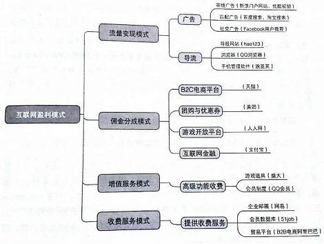
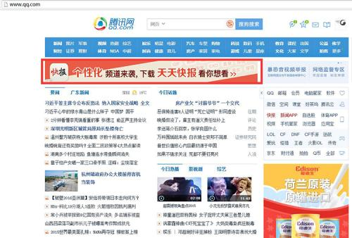

# 互联网时代的盈利模式

随着社会进入互联网时代，互联网公司也不断涌现，而在互联网时代这些公司是如何盈利的呢？

### 盈利模式

大体上互联网盈利模式可以分为：流量变现模式、佣金分成模式、增值服务模式、收费服务模式 
 
而在这些盈利模式中，流量变现模式占据了大多数互联网公司的大头。那么，“流量”究竟是如何给这些公司带来巨额利润的呢？

### 流量是什么？

通常说网站流量（traffic）是指网站的访问量，是用来描述访问一个网站的用户数量以及用户所浏览的页面数量等指标，常用的统计指标包括网站的独立用户数量（一般指IP）、总用户数量（含重复访问者）、页面浏览数量、每个用户的页面浏览数量、用户在网站的平均停留时间等。（摘自百度百科） 
 

简单来说就是流量就是网站的热门程度，然而大多数网站或应用本身都是免费的，它们提供的基础服务也大多是免费的，即使再多的用户进入网站或使用app，似乎他们也没有给互联网公司一分钱，那么这些互联网公司是怎么盈利 ~~（交电费）~~ 的呢？ ~~（用爱发电吗~~ 

### 流量如何变现？

流量毕竟是虚的，要想通过流量赚到钱，就必须通过一些方法将流量变现。 

#### 1.广告

变现流程：互联网产品通过提供廉价甚至免费的服务和平台基础去吸引用户的注入，当具有用户量和平台基础后就具有广告营销的价值，通过为广告主或第三方广告平台提供广告服务赢得丰厚收益。 

其实在互联网时代之前，广告就已经在电视、报刊等媒体中生根发芽了。然而在互联网时代，网络相对于电视报刊有着无法比拟的优势，那就是流量。网站的流量越高，越多的用户进入这个网站，也就意味着网站里的广告会被越多人看到，投放广告的公司自然愿意给予网站更多的报酬。 

就如同以往人们调侃的“广告里插播电视剧”，如今的互联网中广告也是无所不在，其大致可分为三类：（1）在线广告：门户网站的横幅式广告；视频前三位广告。这种广告与传统普通广告没有本质区别。（2）匹配广告：互联网的优势在于会与用户进行交互，在交互过程中，产品端可以更好了解用户，从而产生搜索匹配式广告。百度、谷歌等搜索引擎的每次点击广告收费，淘宝的搜索推荐都有广告佣金。（3）社交广告：QQ空间、朋友圈内都有这种广告，这种广告可以被用户评论，从而产生社交因素，用户可能会出于从众心理进行消费。 

而随着大数据的发展，网站逐渐可以针对用户类型精准投放广告，提高推广的转化率，这也吸引了更多的广告主或第三方广告平台。网站花费大量精力研究用户，无非是为了提高流量变现的效率。 

 

#### 2.导流

变现流程：互联网产品通过将流量导入其它网站或应用，以此获得相应的报酬。 

互联网时代流量的重要性不言而喻，于是便有了给其他网站导入流量的方法来实现流量变现的方法。而导流大致可以分为两种：（1）直接将流量导入其它网站。（2）浏览器、安卓应用市场进行推荐式导流。 

现在的导航网站（如hao123）都是通过方法（1）盈利的（所以也就有了强行将这些网站设为主页的流氓行为）；而各大应用市场（如应用宝）都是通过方法（2）盈利的。事实上，这样的导流行为也能一定程度上的提高网站自身的流量。 

 

#### 3.其他

随着互联网时代的深入发展以及版权意识的加强，过去网站提供廉价甚至免费的服务的现象已经逐渐减少，越来越多的付费增值服务出现，例如各种各样的VIP，付费购买的资料，音乐，视频。这时网站或应用积累的流量便发挥了作用，老用户更愿意使用原网站的服务，新用户也更愿意使用热门网站的服务，于是流量转化为其他付费服务的使用量，实现了变现。例如腾讯就是依靠QQ、微信等免费服务积累了大量的用户和流量，借此发展了一整条产业链，于是才有了如今的企鹅帝国。